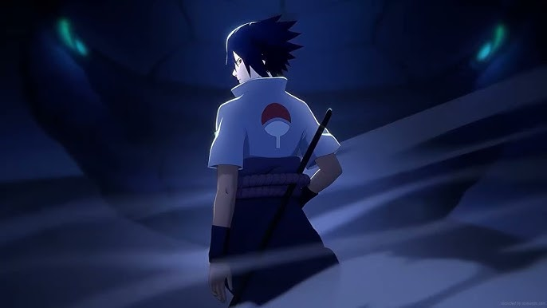

# DReel AI - AI-Powered Video Reel Creator



DReel AI is an innovative web application that transforms your photos into engaging video reels using artificial intelligence. With options to add custom audio or AI-generated narration, it's perfect for content creators looking to quickly produce professional-looking reels.

## Features

- 🎥 Convert multiple images into seamless video reels
- 🎙️ Two audio options:
  - Upload your own audio file
  - Generate AI narration from text
- 🎞️ Automatic video formatting for social media (1080x1920)
- 📁 Easy gallery to browse your creations
- ⚡ Fast processing with FFmpeg

## How It Works

1. Upload your images
2. Choose audio option:
   - Type text for AI narration
   - OR upload your own audio file
3. Let DReel AI process your files
4. Download or share your finished reel

## Installation

1. Clone the repository:
   ```bash
   git clone https://github.com/dushyantsharma460/DReel-AI.git
   cd dreel-ai
Install dependencies:

bash
pip install -r requirements.txt
Install FFmpeg (required for video processing):

On Ubuntu:

bash
sudo apt install ffmpeg
On Mac:

bash
brew install ffmpeg
Run the application:

bash
python app.py
Access the web interface at http://dreelai:4600/

Requirements
Python 3.7+

FFmpeg

Flask

gTTS

Bootstrap 5

File Structure
text
dreel-ai/
├── app.py                 # Main application
├── text_to_audio.py       # Text-to-speech conversion
├── reel_creator.py        # Video processing script
├── static/
│   ├── css/               # CSS files
│   ├── reels/             # Generated video reels
│   └── 1.jpg etc.         # Sample images
├── templates/             # HTML templates
├── user_upload/           # User uploads directory
└── done.txt               # Tracks processed folders
Contributing
Contributions are welcome! Please open an issue or submit a pull request.

License
MIT License
